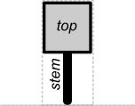
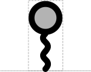
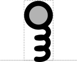
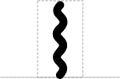

# Biopolymer Location

## Associated SO term(s)
SO:0000699 (Junction, Boundary, Breakpoint)

SO:0001236 (Base)

SO:0001237 (Amino Acid)

## Recommended Glyph and Alternates

Biopolymer Location is a "stem-top" glyph for describing small sites. In this system:

- the top glyph indicates the type of site (e.g., Biopolymer Location)
- the stem glyph indicates whether the site affects DNA, RNA, or protein (respectively: straight, wavy, or looped)

The RECOMMENDED top for Biopolymer Location is a circle, reminiscent of a pin stuck into a location (in order: DNA, RNA, Protein):

An alternative is to have "nothing" for the top, just an extended version of the stem itself (in order: DNA, RNA, Protein):

## Prototypical Example

CRISPR-targeted insertion site, protease site, mutation site

## Notes
Biopolymer Location is a general glyph for all zero- and one-length sequence features, including insertion and deletion sites and X-ase cut sites.

Note also that Biopolymer Location does not cover stability elements, since their length is typically multiple bases / amino acids.

Describing a Restriction Enzyme Cleavage Site with a vertical line glyph on a DNA backbone (as done previously in SBOL Visual 1.0 via the Restriction Enzyme Recognition Site glyph) can persist in a SBOL Visual 2 diagram and still be considered compliant with SBOL Visual 2, where it is now classified as a Biopolymer Location (which is a superclass of cleavage sites). Thus, the Biopolymer Location glyph from SBOL Visual 2.0 is backwards compatible with the Restriction Enzyme Recognition Site glyph from SBOL Visual 1.0.
